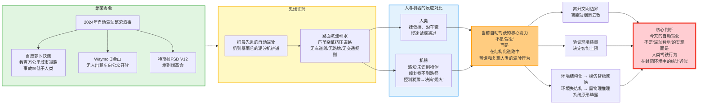
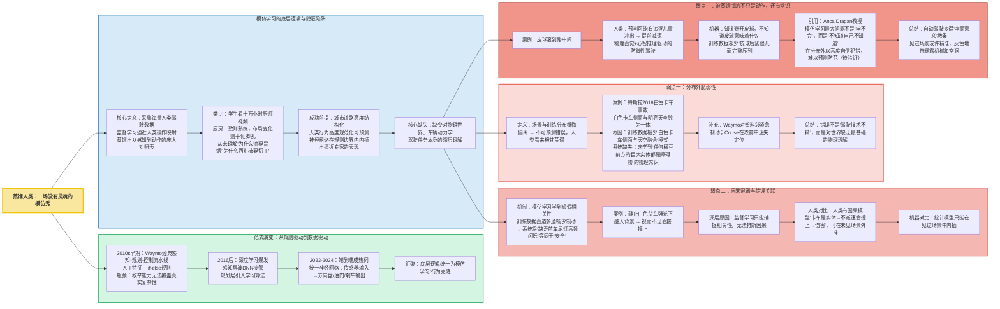
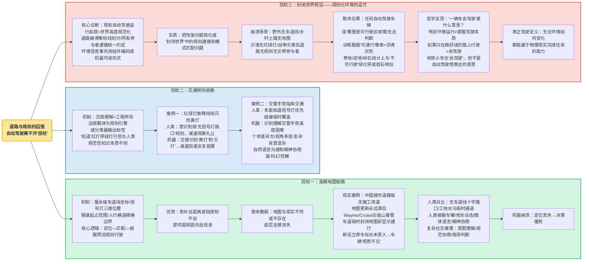
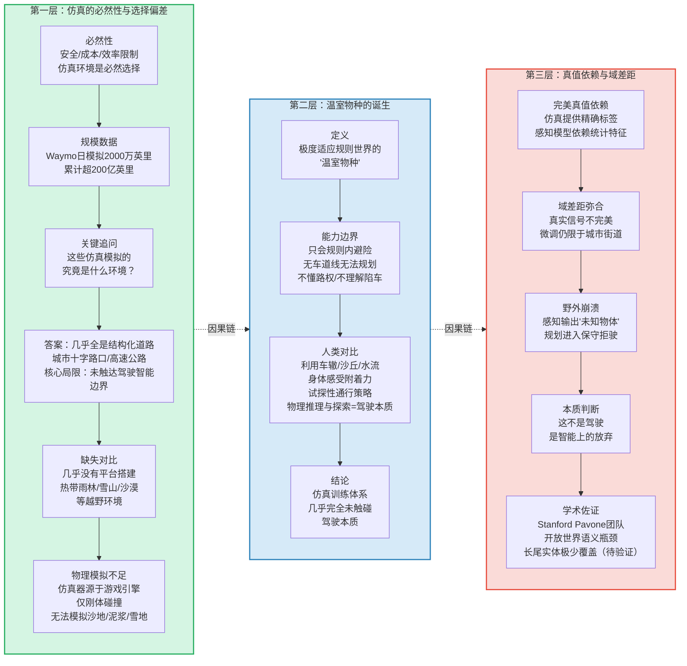
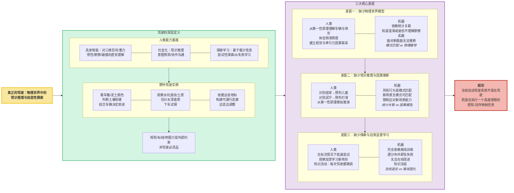
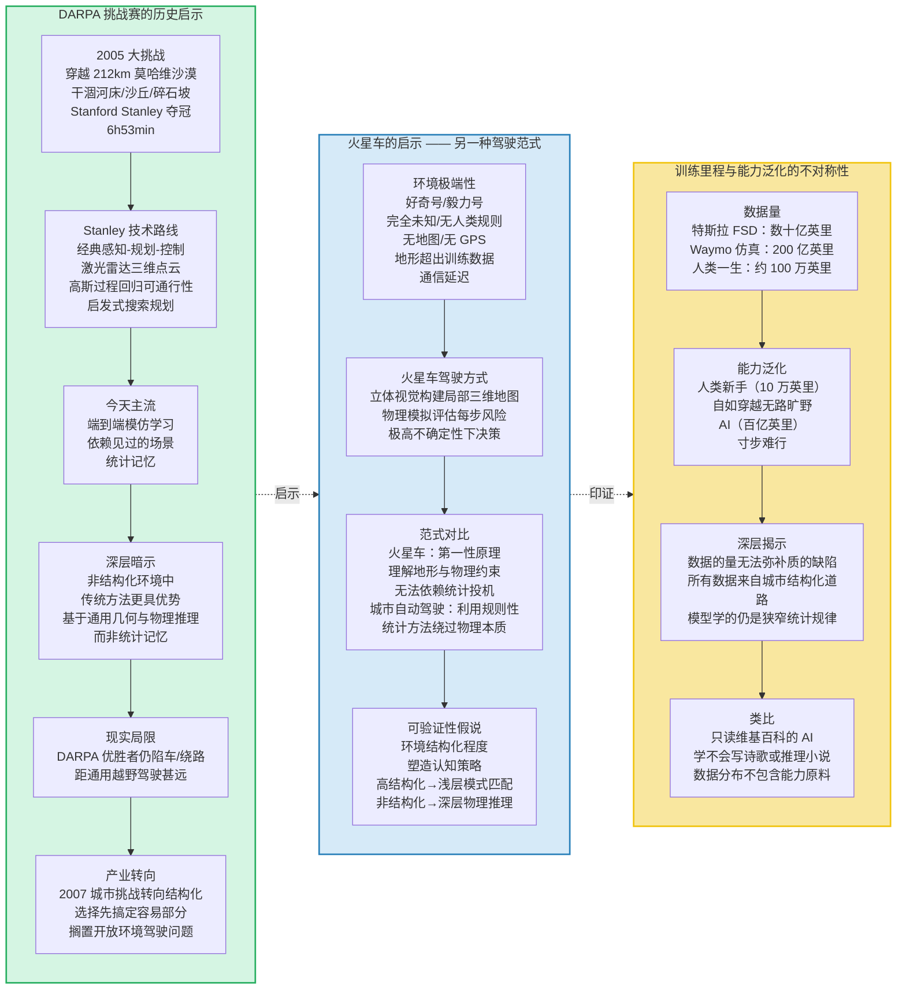
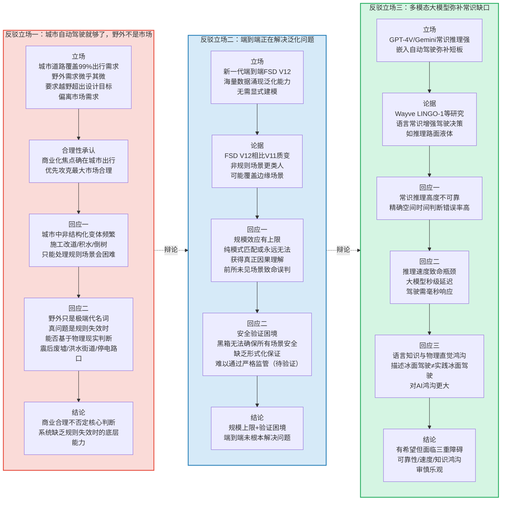
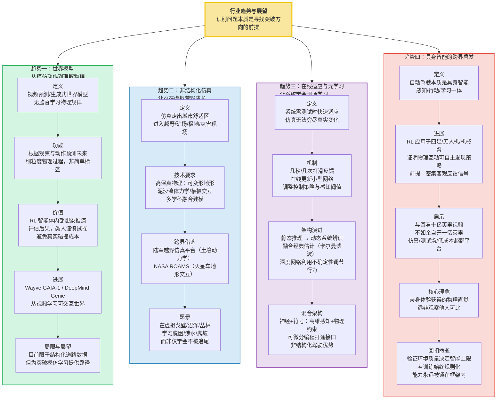
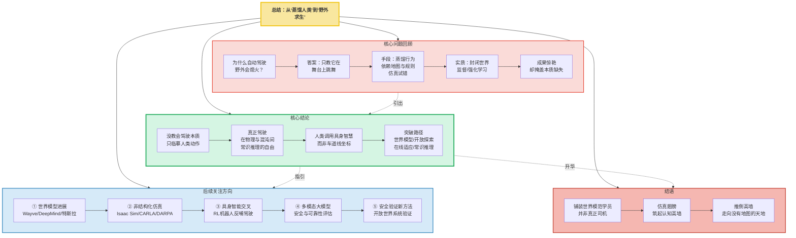

# 被高估的智能：自动驾驶为何还处于“低级”阶段

> 前自动驾驶研发工程师：如果你在路上看到自动驾驶测试车，请尽量保持距离。现在的自动驾驶车辆看似从容，实则从未真正学会驾驶；城市高架上的流畅表现，本质上是对规则化环境中人类行为的统计逼近——依赖高精地图、清晰标线和预设交规。然而，从感知、预测到规划，每个模块都是概率模型，输出的只是“置信度”，而非确定性的因果理解。当场景落在训练分布之内，一切正常；一旦遭遇数据长尾中的未知环境，或模型权重发生偏差，它便可能以极高的置信度，给出一个荒唐的判断。

## 1. 背景与问题：为什么要谈这个话题

2024年，百度“萝卜快跑”在武汉的运营数据令人瞩目：数百万公里的城市道路行驶，事故率低于人类驾驶员平均水平。与此同时，Waymo在旧金山的无人出租车服务已向公众开放，特斯拉的FSD（完全自动驾驶）系统在北美推送了V12版本，被马斯克称为“端到端革命”。一切都指向一个令人振奋的叙事：自动驾驶正在从科幻走进日常。

但让我们做一个思想实验。把当今最先进的自动驾驶汽车——无论来自哪个厂商——从标线清晰的柏油路拖出来，扔到一条暴雨过后的泥泞机耕道上。路面坑洼积水，芦苇和杂草从两侧向内挤压，没有车道线，没有路牌，没有任何预设的交通规则。它只知道GPS给出的模糊方向：前方三公里有一个村庄。任何一个持有驾照的普通人，哪怕从未见过这种环境，也会挂低挡、沿着前车的车辙、慢速试探着把车开过去。但今天最昂贵的自动驾驶系统，几乎可以肯定会立即“熄火”——不是发动机熄火，而是整个决策系统陷入混乱：感知模块输出一连串“未识别物体”，规划模块找不到可通行的路径，控制模块在犹豫要不要把眼前那片高草地当作障碍物。

这暴露了一个根本性的问题：**当前自动驾驶的核心能力，本质上并不是“驾驶”，而是“在结构化道路中蒸馏和复现人类的驾驶行为”。** 它是在人类街道、交通法规和文明社会所构建的边界之内，对人力驾驶水平的模仿与重组。离开这些边界，智能就烟消云散。

这一困境并非自动驾驶独有。在更广义的人工智能领域，研究者们正在意识到一个被长期忽视的维度——验证环境的质量决定了智能的上限（参见Google DeepMind关于AGI到ASI演化的分析）。自动驾驶恰好提供了一个极端鲜明的例证：当环境高度结构化、规则明确、反馈信号清晰时，基于模仿和模式匹配的“智能”表现得令人惊艳；当环境失去结构、规则消失、需要从第一性原理进行物理推理时，同一套系统便原形毕露。

本文旨在剖析这一困境的深层成因，指出为什么“仿真+模仿”的路径虽然解决了效率问题，却仍然无法跨越到真正通用的驾驶智能，并探索可能的出路。论证将围绕一个核心判断展开：**今天的自动驾驶不是“驾驶智能”的实现，而是“人类驾驶行为在封闭环境中的统计近似”。**

## 2. 核心内容展开

### 2.1 蒸馏人类：一场没有灵魂的模仿秀

#### 从规则驱动到数据驱动：自动驾驶范式的演变

要理解当前自动驾驶的本质，需要先回顾这一领域的技术演进。2010年代早期的自动驾驶系统，以Waymo的前身Google Self-Driving Car Project为代表，采用的是经典的“感知-规划-控制”流水线架构：传感器数据经过人工设计的特征提取器，进入基于规则的规划模块，再输出到PID控制器或模型预测控制器。这套架构的每一层都由工程师手工设计——感知层需要精确标注车道线和障碍物，规划层需要工程师编写大量的if-else规则。

这种方法的瓶颈显而易见：真实世界的复杂性远超任何工程师团队的枚举能力。2016年后，随着深度学习的爆发，行业逐渐转向数据驱动范式。感知层率先被深度神经网络接管，随后规划层也开始引入学习算法。到了2023-2024年，“端到端”自动驾驶成为行业热词——用一个统一的神经网络，直接从传感器输入映射到方向盘、油门和刹车的控制输出。

#### 模仿学习的底层逻辑与隐蔽陷阱

当前乘用车自动驾驶的算法范式，无论被称为“端到端”“模仿学习”还是“行为克隆”，其底层逻辑都可以归结为同一个过程：采集海量人类驾驶数据，通过监督学习让神经网络逼近人类驾驶员在各类场景下的操作映射。传感器的输入是摄像头、激光雷达等，输出是方向盘转角、油门和刹车踏板的控制量，中间的神经网络则是用人类驾驶员的操作作为“标准答案”来训练的。这在本质上不是让机器理解驾驶，而是让机器蒸馏出一张从感知到动作的庞大对照表。

为了帮助外行读者理解，可以做这样一个类比：这就像让一个学生通过观看十万小时的厨师视频来学习做菜。如果所有视频中的厨房布置、食材摆放、厨具位置都高度一致，这个学生确实可能学会“当看到西红柿时切丁，当看到油冒烟时下锅”——他表现得像个熟练的厨师。但一旦厨房的布局变了，或者食材以他不熟悉的方式出现，或者锅的材质不同导致导热速度不同，他就会手忙脚乱。因为他从未理解“为什么油要烧到冒烟”“为什么西红柿要切丁”——他只是在复现动作序列。

这种蒸馏式学习能够成功，前提是训练数据覆盖了几乎所有需要应对的场景。得益于城市道路的高度结构性——车道线、信号灯、限速标志、明确的通行规则——人类驾驶员的行为本身已经高度规范化和可预测。因此，一个足够大的神经网络可以在这些规则边界内内插出极其逼近人类专家的表现。这便是我们看到的：越是在道路设施完善、交通参与者守规矩的城市，自动驾驶就越显得“聪明”。但这种聪明的背后，缺少对物理世界、车辆动力学和驾驶任务本身的深层理解。

#### 分布外脆弱性：当像素模式背叛了你

这就引出了行为克隆的第一个致命弱点：**分布外脆弱性**。当场景与训练数据的统计分布发生细微偏离，神经网络就可能给出不可预测的错误输出。这种错误在人类看来极其荒谬——比如把挂在卡车尾部的广告照片当成真实障碍物紧急刹车，或者在日落逆光把路面照成金黄色时猛烈转向。因为系统并不知道“广告照片”和“真实车辆”的物理差异，它只记得某些像素模式对应着“需要刹车”。

一个已被广泛讨论的案例是特斯拉Autopilot的“白色卡车”事故。2016年，一辆处于Autopilot模式下的特斯拉Model S在佛罗里达州高速公路上，以全速撞上一辆横穿道路的白色半挂卡车，驾驶员当场死亡。美国国家运输安全委员会的调查报告指出，系统未能将白色卡车车身与明亮的天空背景区分开来。在训练数据中，系统见过无数“卡车”和“天空”分别出现的场景，但很少见过“白色卡车侧面与明亮天空融为一体”的像素模式。它没有学会“任何横亘在前方道路上的巨大实体都是障碍物”这个人类凭物理直觉就能把握的常识。

类似的案例在行业里并不罕见。Waymo的车辆曾对吹过路面的塑料袋紧急制动；Cruise的车辆曾在旧金山的浓雾中迷失定位。每一次，系统的错误都不是“驾驶技术不精”，而是它对世界缺乏最基础的物理理解。

#### 因果混淆：当“不刹车”被等同于“安全”

第二个致命弱点是**因果混淆与错误关联**。模仿学习很容易学到虚假的相关性：训练数据中，多数直道行驶时前方都是畅通的，车辆很少需要紧急制动。于是系统可能无意中将“缺乏前车尾灯的高频闪烁”等同于“安全”。当一个静止的白色货车在强光下完全融入背景时，它便视而不见，直接撞上去。特斯拉多起致命事故都与这种因果混淆有关。机器只是在模仿人类的“动作”，却没有内化人类对世界的“判断”。

这一问题的本质在于：监督学习只能捕捉相关性，无法推断因果。人类驾驶员之所以能安全驾驶，不是因为他们在统计意义上记住了“刹车”和“障碍物”的关联，而是因为他们拥有一个因果模型——“那辆卡车是实体，如果我不减速就会撞上，撞击会导致伤害”。因果模型的强大之处在于，它可以在从未见过的场景中进行外推。而统计模型只能在见过的场景中进行内插。

#### 被蒸馏掉的不只是动作，还有常识

更为隐蔽的是，蒸馏人类驾驶的同时，也蒸馏了人类的偏见、习惯和法规的局限性，却过滤掉了人类独有的常识推理。人类驾驶员在看到一个滚到路中间的皮球时，会立刻预判可能有追逐的儿童冲出来，并提前减速。这种由物理直觉和心智推理共同驱动的“防御性驾驶”，在模仿学习中几乎不可能通过单纯的动作回归获得，因为训练数据里极少出现皮球之后紧跟着儿童的完整序列。系统可能知道要避开皮球，却不知道皮球意味着什么。

自动驾驶因此变得“字面意义”上的教条：它在处理见过的场景时或许精准，但在遇到世界未曾写在数据集里的灰色地带时，就暴露出机械和空洞。正如加州大学伯克利分校的Anca Dragan教授所指出的，模仿学习最大的问题不是“学不会”，而是“不知道自己不知道”——系统在分布外场景中不仅会犯错，而且会以高度自信的方式犯错，这使得错误难以被预测和防范（待验证）。

### 2.2 道路与规则的囚笼：为何自动驾驶离不开“拐杖”

#### 高精地图：一把双刃剑的依赖

如果仅仅是模仿人类，自动驾驶或许至少能在人类常走的路线上替代人类。问题在于，今天的自动驾驶不仅模仿人类驾驶的动作，还深度依赖另一套“拐杖”：高精度地图、车道线、交通标志和预设的通行规则。绝大多数系统一旦离开这些，就相当于盲人失去了手杖。

高精度地图几乎是当前L4级自动驾驶的必备条件。地图里预先存储了每一条车道的精确几何信息——厘米级的车道线坐标、信号灯的三维位置、限速规则的起止范围、人行横道的精确边界。车辆在运行时，先通过激光雷达或视觉定位匹配到地图的某一点，然后在“已知的世界”里规划路线。它的核心逻辑是“定位—匹配—根据预设规则行驶”，而不是根据实时环境灵活构造可通行区域。

这种做法在结构化的城市中非常高效。它可以弥补感知模块在远距离、遮挡场景下的不足，可以提供超视距的先验信息。但也导致了一个根本性的脆弱：**一旦地图与现实不符，或者根本不存在地图，系统就失去了底层支撑。** 中国的城市道路几乎每天都在施工、改道、重画标线，地图更新永远滞后于现实。Waymo和Cruise在旧金山遇到的许多“接管”事件，根源都在于地图与现实的不一致——一条车道被临时封闭，地图却显示可以通行；一个新设立的停车标志尚未被录入地图，车辆便“视而不见”。

面对一个没有车道线的十字路口，或者被工地水马挤占得七扭八歪的临时通道，人类司机会根据车辙、其他车辆的动态、交通指挥员的肢体语言甚至眼神来协商通行。这是一套极其复杂的社交推理过程，涉及意图理解、规范协商和临场判断。而自动驾驶系统则会陷入“定位丢失-决策僵死”的困境。

#### 当规则遇到例外：交通灯的闪烁与交警的手势

更深层的依赖在于交通规则本身。自动驾驶系统对交规的理解，本质上是工程师和地图团队将法规逐条翻译成规则引擎中的确定性逻辑或分类器的输出标签。它“知道”红灯停、绿灯行，但这里的“知道”与人类理解的规范性知识有本质区别。

当人类遇到红绿灯故障持续闪烁黄灯时，会意识到这里应该按照“无信号灯路口”的规则，减速观察、礼让通行。但机器呢？它可能只被训练识别红、绿、黄三种稳定的灯色，闪烁的黄色可能被交替识别为“黄灯”和“灭灯”，导致系统在减速和加速之间反复摇摆。同样，当交警用手势和哨声指挥交通时，人类几乎本能地知道此时交通信号灯的优先级被临时覆盖了，而绝大多数自动驾驶系统要识别和理解交警手势，至今仍是一项高度困难的工程挑战——交警的动作因个体差异巨大、视角变化多端、且常与复杂背景混杂。至于自然语言沟通或眼神协商，对机器来说更属于“科幻”范畴。

#### 封闭世界的诅咒

以上问题共同指向一个事实：**现有自动驾驶的运行前提是世界高度规范化。** 它要求道路被清晰标线划分，要求所有参与者遵循统一的约定，要求环境信息被事先测绘并编码成机器可读的形式。这是把驾驶问题简化成了一个“封闭世界”中的规则遵循和模式匹配问题。

但在真实的人类驾驶实践中，规范只是背景，而非全部。野外没有车道线，乡村土路没有地图，沙漠里没有红绿灯，战争或灾害后的道路上既无规则也无其他文明的参与者。今天任何一辆引以为傲的自动驾驶车辆，在这些场景面前都不堪一击。把汽车放到野外，它可能连“哪里是可行驶区域”都无法判断——因为训练数据中几乎所有“可通行”的像素都是沥青灰色，而草地、泥地、砂石在统计上与“不可行驶”的绿化带或岩石高度相似。

这引出了一个哲学层面的思考：当我们说“一辆车会驾驶”时，我们到底在说什么？是说它能在特定环境中运行，还是说它掌握了驾驶这一活动本身的本质？如果只能在画好线的路上行驶就叫“会驾驶”，那么地铁和火车也“会驾驶”——它们甚至跑得更快更安全。但这显然不是我们谈论“自动驾驶”时想要表达的意思。真正的驾驶，应该是一种无论环境如何变化，都能基于物理现实完成任务的能力。

### 2.3 仿真幻境：在虚拟城市中学不会荒野求生

#### 仿真的必然性及其选择偏差

由于安全、成本和效率的限制，强化学习式的自动驾驶训练不可能在真实道路上从零开始——那将意味着数以万计的真实碰撞和伤亡。因此，仿真环境是必然选择。Waymo、Cruise、特斯拉等企业纷纷构建了巨大规模的仿真平台。Waymo在2021年披露的数据显示，其仿真系统每天模拟约2000万英里的驾驶里程，累计已超过200亿英里。这些仿真模拟的，究竟是什么环境？

答案是：**几乎全部是结构化道路环境。** 仿真器精心建模了城市十字路口、高速公路、住宅区街道，有车道线、交通标志、人行道和信号灯。它们生成的“长尾场景”主要是交通流中的危险事件，比如突然横穿的行人、急刹的前车、逆行加塞的电动车。这些场景对于城市自动驾驶的落地确实至关重要，但它们仍然是在“文明驾驶”的边界之内，没有触及驾驶智能真正的边界。

几乎没有哪个自动驾驶仿真平台，会去精心搭建热带雨林中被倒木半掩的泥泞小道、雪山融水冲刷的碎石河床、或者中东沙漠中只有车辙印迹的无形之路。即使搭建了，也缺乏足够的物理模型来模拟车辆在松软路面上的沉陷、打滑以及底盘触底时反推给车身的复杂力学反馈。这些仿真器大多数脱胎于游戏引擎（如Unreal Engine、Unity），擅长渲染视觉，但物理引擎更多是为刚体碰撞和简单悬挂设计的。要精确模拟沙地的颗粒流动、泥浆的塑性变形、雪地的压缩沉陷，需要的是另一套完全不同量级的物理求解器。

#### 温室物种的诞生

这造成的后果是，从仿真中“毕业”的自动驾驶策略，是一种极度适应结构化世界的“温室物种”。它在千百万次碰撞和危险场景中学会了如何在规则之内避险，但完全没有接触过规则之外的世界。没有车道线，它无法规划路径；没有交通标志，它不懂路权；路面不再是平面刚体，它无法理解滑动和陷车，更无法生成脱困策略。

而对于一个人类驾驶员来说，面对车辙印迹、沙丘走势、水流方向以及自己对车辆姿态和轮胎附着力的身体感受，能够综合出一个试探性的通行策略。这种在完全不确定和非结构化环境中的物理推理与探索能力，才是“驾驶”的深层本质，而今天的仿真训练体系几乎完全没有触碰。

#### 仿真中的“真值依赖”问题

更进一步，现有的仿真与行为克隆结合的方式，强化了系统的“机械模仿”，却削弱了其“真实理解”。在仿真中，我们可以轻易获得完美的传感器真值——每个物体的精确三维边界框、语义标签、运动状态。这些真值被用来训练感知模型，虽然极大提高了效率，但也让模型依赖于仿真特有的视觉统计特征和精准的标注信号。

到了真实世界，这些信号不再完美，模型就必须靠微调来弥合差距。这就是所谓的“仿真到现实的域差距”问题。然而，这种微调仍是在结构化城市街道的数据上进行，野外场景的真值和真实数据都极度稀缺。因此，系统即使被放在野外，其感知模块输出的仍然是“未知物体”“不可识别区域”，随后下游规划模块进入安全保守模式——直接拒绝行驶。这不是驾驶，这是智能上的放弃。

值得注意的是，这一问题在自动驾驶的学术研究中已有明确讨论。斯坦福大学的Marco Pavone团队指出，当前的自动驾驶系统在“开放世界”场景中面临根本性的语义瓶颈——系统只能识别训练中见过的物体类别，而真实世界充满了各种训练数据中不存在的“长尾实体”（待验证）。在城市中，这类实体相对较少；在野外，它们构成环境的绝大部分。

### 2.4 真正的驾驶：物理世界中的常识推理与创造性探索

#### 驾驶的深层定义

要理解为什么人类可以把车开到任何地方，而机器不行，我们需要反思“驾驶”的更深层定义。驾驶，从根本上是人类利用工具（车辆）在复杂物理环境中完成从A点到B点的移动任务。这种能力深深地植根于人类的具身智能：我们在亿万年进化中获得的对三维空间、重力、惯性、摩擦、碰撞的直觉物理理解；我们在成长和社会化过程中获得的常识推理、意图预测和协作沟通能力；以及我们面对完全陌生环境时，可以基于极少的信息进行尝试性探索，并从失败中即时学习策略迁移的能力。

当人类第一次开车进入一片未曾铺装的荒野，看到前车留下的模糊车辙，可以根据车辙的深度和两侧泥土的颜色粗略判断土壤的软硬，结合自己车辆是前驱还是四驱、底盘多高，决定是否继续前进。遇到一段水坑，人类会观察水面的波纹、岸边土质、是否有植物生长来估计水深和底质，甚至可能下车用树枝试探。在完全没有路的地方，人类会依据远处的地标，在心里构建一个大致的“可通行走廊”，然后边走边调整。整个过程中，驾驶行为与对物理世界的探索、推理、小范围试错密不可分。规则、标线、地图从不是必须品，而只是人类为了提升大规模交通效率和安全而建立的外部约束。

#### 三大核心差距

由此，我们可以看到当前自动驾驶与真正驾驶之间的三大核心差距。

**第一，缺少物理世界模型。** 今天的自动驾驶系统没有对车辆动力学和地形相互作用的深层理解。它可以把车辆当前的侧向加速度、横摆角速度等信号作为输入，但从没有“体会”过即将侧滑的微妙预感，也没有将视觉地形（泥土、沙地、岩石）与相应的牵引力特性建立因果联系。它知道“湿滑路面要慢”，但这种“知道”来自训练数据中的统计关联，而非对摩擦系数和动量转移的物理推导。这使得它在面对从未见过的路面类型时，无法从第一性原理出发做出合理推断。

**第二，缺少常识推理与因果推断。** 机器可以识别“皮球”，但不能推断皮球可能来自一个孩子；可以识别“泥泞”，但不能推断泥泞意味着车轮可能打滑并需要降低胎压或改变转向策略。所有行为都是模式匹配，而不是从第一性原理出发的模拟推演。这一缺陷不仅影响安全性，更从根本上限制了系统应对新场景的能力——因为新场景中不存在可供匹配的“模式”。

**第三，缺少探索和自我监督学习的能力。** 人类可以在完全没有标注的情况下，通过低速尝试和观察车辆反馈（如车轮空转、车身倾斜）来快速学习新地形的通过方法。今天的自动驾驶则完全依赖离线训练，一旦遇到分布外场景即告失败，无法在线改进。它的知识是“冻结”的——出厂时什么样，运行时就是什么样。而人类的驾驶知识是“流动”的——每一次新的驾驶经历都在微调我们对车辆、道路和物理世界的理解。

这三点让机器失去了应对开放世界的根本能力。它们共同指向同一个结论：**当前的自动驾驶系统不是在驾驶，而是在执行一个高度受限的感知-动作映射任务。**

## 3. 深度分析

### 3.1 案例与数据：边界在哪里？

#### 非结构化环境中的真实表现

为了更具体地理解当前自动驾驶的能力边界，有必要考察它在非结构化环境中的真实表现。遗憾的是，主流自动驾驶企业几乎不公开这类测试数据——因为它们的系统根本不是为这些环境设计的。但学术界和军方的研究提供了有价值的参考。

DARPA（美国国防高级研究计划局）在2004年、2005年和2007年举办的三届“大挑战”和“城市挑战”，是自动驾驶历史上标志性的事件。2005年的“大挑战”要求参赛车辆自主穿越212公里的莫哈维沙漠，包含干涸河床、沙丘、碎石坡等典型非结构化地形。斯坦福大学的Stanley最终以6小时53分钟夺冠。值得注意的是，Stanley采用的技术路线是经典的“感知-规划-控制”架构，依赖激光雷达构建三维点云、用高斯过程回归估计可通行性、并通过启发式搜索规划路径——而不是今天主流的端到端模仿学习。这暗示着一个有趣的对比：在非结构化环境中，传统方法可能比数据驱动的模仿学习更具优势，因为它不依赖对“见过场景”的统计记忆，而是基于通用的几何和物理推理。

然而，即使是DARPA挑战赛的优胜者，其表现距离“通用越野驾驶”也相去甚远。比赛中车辆多次出现因沙地松软而陷车、因无法判断植被下地形而绕路数十公里等情形。2007年“城市挑战”转向了结构化城市环境后，自动驾驶的商业化前景才开始被广泛关注——这本身就说明，**自动驾驶产业实际上选择了“先搞定容易的部分”——即规范化、结构化的城市道路——而将真正困难的开放环境驾驶问题搁置了。**

#### 对比：火星车的启示

一个鲜少被自动驾驶行业提及但极具启发性的对比是火星车。NASA的“好奇号”和“毅力号”火星车每天在完全未知、没有任何人类规则的地表上自主行驶。它们面临的环境比地球上任何越野场景都更极端：没有地图、没有GPS、地形类型完全超出训练数据、通信延迟使得远程操控不现实。然而，这些火星车确实在“驾驶”——它们基于立体视觉构建局部的三维地形图，通过物理模拟评估每一步行动的风险，并在极高不确定性下做出安全决策。

火星车的自主导航与地球上的城市自动驾驶之间有本质差异吗？从验证环境的视角来看，答案是肯定的。火星车的系统必须从第一性原理出发理解地形和物理约束，因为它面对的是完全开放的环境，无法依赖任何“统计相关性”来投机取巧。而城市自动驾驶恰好相反——它利用环境的高度规则性，用统计方法绕过对物理本质的理解。这两种范式之间的鸿沟，正是“可验证性假说”在自动驾驶领域的生动体现：**验证环境的结构化程度，塑造了智能体所采用的认知策略。** 在高结构化的城市道路中，浅层的模式匹配已经足够获得好的表现；但在非结构化的野外，只有深层的物理推理才能生存。

#### 数据对比：训练里程与能力泛化

另一个值得关注的维度是训练数据量与能力泛化程度之间的不对称性。截至2024年，特斯拉FSD的累计训练里程据称已超过数十亿英里（真实驾驶+仿真），Waymo的仿真里程也超过200亿英里。这些数字远超任何人类驾驶员一生的驾驶里程（约100万英里）。然而，一个只开了10万英里的新手司机可以自如地驾车穿越无路的旷野，而一个“吃”了百亿英里城市道路数据的系统却寸步难行。

这种不对称性揭示了一个深层事实：**训练数据的“量”无法弥补“质”的缺陷。** 如果所有的训练数据都来自高度相似的环境分布（城市结构化道路），那么即使数据量再大，模型学到的也仍然是一个狭窄领域的统计规律。类比于语言模型，这就像一个只读过维基百科的AI，无论读多少遍，也无法学会写诗歌或推理小说——因为维基百科的数据分布本身就不包含这些能力所需的“原材料”。

### 3.2 反面观点与争议

#### 立场一：“城市自动驾驶就够了，野外不是市场”

对于本文的核心论点——当前自动驾驶不是真正的“驾驶”——一个直接的反驳来自商业实用主义立场。持这一立场的从业者可能会说：**城市结构化道路覆盖了99%的人类出行需求，在野外环境中行驶的需求微乎其微。** 即使自动驾驶永远无法在非结构化环境中运行，只要它能安全地在城市和高速公路上替代人类驾驶员，其社会价值和经济价值就已经足够巨大。要求自动驾驶也能越野，就像要求民航客机也能在未铺装跑道上起降——这超出了它的设计目标，也偏离了市场需求。

这一立场有其合理性。当前自动驾驶的商业化焦点确实在城市出行场景，而非荒野探险。Waymo、Cruise、百度Apollo的商业策略都明确聚焦于城市robotaxi服务。从投资回报的角度来看，优先攻克市场最大的场景，将困难边缘场景留给未来，是合理的商业决策。

然而，这一反驳并没有动摇本文的核心判断，因为：**第一，即使在城市环境中，“非结构化”的变体也频繁出现。** 施工改道、临时交通管制、道路积水、落石或倒树阻断——这些都是城市驾驶中“局部非结构化”的实例。一个只能处理规则场景的系统，在面对这些日常的“不规则的规则”时也会遇到困难。**第二，“野外”只是极端情况的代名词。** 真正的问题不在于是否要去戈壁滩上开车，而在于系统是否具备在“规则失效”时仍能基于物理现实做出合理判断的能力。在大地震后的城市废墟中、在洪水淹没的街道上、在突然出现的大规模停电导致所有信号灯熄灭的十字路口——这些场景不是“野外”，但它们同样需要系统超越规则遵循、调用物理推理和常识判断。

#### 立场二：“端到端正在解决泛化问题”

另一个更技术性的反驳来自端到端路线的支持者。他们可能会说：**你批判的模仿学习是2020年的老版本。新一代的端到端系统——如特斯拉FSD V12——已经通过海量数据的规模效应展现出了令人惊讶的泛化能力。** 随着数据量的持续增长，模型正在自发地“涌现”出对物理世界的理解，无需显式建模。

这一观点在2024年获得了不少支持。特斯拉FSD V12的表现相比V11有了质的提升，在许多非规则场景中展现出更平滑、更类人的行为。如果这一趋势持续，也许只要数据量继续增长、数据多样性继续扩展，端到端模仿学习最终能覆盖足够多的边缘场景，实现事实上的“通用驾驶”。

对此，有两个层面的回应。

**第一，规模效应的上限问题。** 大语言模型的经验表明，扩大数据量和模型规模确实能带来令人惊讶的涌现能力，但这种涌现并非无上限。语言模型在推理、数学等需要深层因果理解的领域仍然存在根本性的瓶颈。在自动驾驶中，这意味着无论数据量多大，如果模型本质上是在做模式匹配，它就可能永远无法获得真正的因果理解。当一个前所未有的场景出现——比如天空中突然落下一棵被龙卷风吹来的树——人类可以基于物理直觉立即判断危险并采取行动，而一个纯粹基于统计的系统只能在它的“模式库”中搜索最接近的匹配，这可能导致致命的延迟或误判。

**第二，安全验证的困境。** 即使端到端系统在实际表现上很好，我们也面临一个根本性的验证问题：如何确保一个黑箱神经网络在所有可能的场景中都安全？基于规则的经典架构虽然笨拙，但其行为在逻辑上是可追溯的。基于模仿学习的端到端系统则不同——我们只能通过大量测试来“赌”它没有学会危险的错误关联。这使得安全认证成为一个难以逾越的障碍。正如Mobileye首席执行官Amnon Shashua所论证的，纯粹依赖数据驱动而缺乏形式化安全保证的系统，在可预见的未来可能难以通过严格的安全监管（待验证）。

#### 立场三：多模态大模型正在弥补常识缺口

随着GPT-4V、Gemini等多模态大模型的发布，一个新观点浮出水面：**也许我们不需要在自动驾驶系统中内建物理模型，因为大语言模型和多模态模型已经展现出了惊人的常识推理能力。** 将视觉语言模型嵌入自动驾驶的感知或规划环节，或许能够弥补模仿学习缺乏常识的短板。

这一方向确实充满希望。2024年，多家研究机构发布了将大语言模型或多模态模型应用于自动驾驶决策的工作，如Wayve的LINGO-1、清华大学的DriveGPT等。这些工作试图利用语言模型中蕴含的常识知识来增强驾驶决策的合理性——例如，当检测到前方路面有不明液体时，系统可以“推理”出那可能是水或油，无论哪种都应该减速通过。

然而，有几个理由让我们对这一路径保持审慎乐观。第一，多模态模型目前的常识推理仍然高度不可靠——它们在简单的视觉问答中表现良好，但在需要精确空间推理和时间判断的驾驶场景中，错误率仍然高得难以接受。第二，推理速度是致命瓶颈——大模型的推理延迟通常以秒计，而驾驶决策需要毫秒级的响应。第三，也是最重要的，语言中的常识与驾驶中的物理直觉是两种不同的能力。一个人可以流畅地描述如何在冰面上驾驶，但他第一次真正在冰面上开车时仍然可能失控——因为语言知识和身体直觉之间存在鸿沟。对AI来说，这一鸿沟只会更大。

## 4. 行业趋势与展望

尽管前文的论证指向了当前自动驾驶范式的根本局限，但这并非悲观主义。相反，识别出问题的本质，正是寻找突破方向的前提。以下是几个正在孕育或值得探索的变革方向。

### 趋势一：世界模型——从“模仿动作”到“理解物理”

近年来，以视频预测、生成式世界模型为代表的方向，让机器有机会不依赖人类标注动作，而是通过海量无监督数据学习物理世界的运行规律。一个驾驶世界模型应能根据当前观察和拟采取的动作，预测未来一系列可能的环境状态，包括其他交通参与者的反应、路面附着力的变化、以及自车动力学响应。

这种预测不是标签级的“碰撞/不碰撞”，而是以像素、体素或隐空间状态的形式，保留细粒度的物理过程。有了这样的世界模型，强化学习智能体就可以在模型内部进行“想象推演”，在做出动作之前评估其后果，从而具备类人的谨慎、试探和推理能力，而不必每次都靠实际碰撞来获得代价高昂的梯度。

这一方向在2024年获得了显著进展。Wayve发布了GAIA-1世界模型，能够根据初始视频帧和驾驶动作生成逼真的未来驾驶场景。Google DeepMind的Genie则展示了从视频数据中学习可交互世界模型的潜力。值得关注的是，这些模型目前仍主要在结构化道路数据上训练，尚未向非结构化环境扩展——但它们所代表的技术路线，为突破“模仿学习”的局限提供了切实可行的路径。

### 趋势二：非结构化仿真——让AI在虚拟荒野中成长

现阶段的仿真必须从城市道路的舒适区走出来，进入越野、矿场、极地、灾害现场等完全不同的物理域。这意味着仿真引擎需要大幅提升物理模拟的保真度：除了视觉渲染，还需要模拟可变形地形、泥沙流体力学、植被与车体的交互、极端天气下的能见度和传感器退化。

这不仅仅是算力问题，更是需要多学科融合的复杂建模工作。值得注意的是，工程车、火星车、军用无人车辆等领域已经积累了大量非结构化环境下的仿真和实车经验。例如，美国陆军研究实验室开发了用于越野自主导航的物理仿真平台，能够模拟多种土壤类型下的车辆动力学。NASA喷气推进实验室为火星车开发的ROAMS仿真系统，可以精确模拟岩石爬升、沙地沉陷等复杂地形交互。自动驾驶行业完全可以跨界借鉴这些成果。

一旦这样的仿真环境被建立，智能体就可以在数百万种虚拟的戈壁、沼泽、丛林中安全地学会脱困、涉水、爬坡和自救策略，而不是像现在这样只学会“如何不被追尾”。

### 趋势三：在线适应与元学习——让系统学会“现场学习”

最终，任何仿真都无法穷尽真实世界的无限变化。通用驾驶系统必须具备在测试时快速适应的能力：当它第一次遇到完全陌生的路面时，可以在几秒钟甚至几次车轮打滑的反馈中，通过在线更新的小型网络或非参数记忆模块，调整自身的控制策略和感知阈值。

这要求算法架构从单纯的静态推理，演进到动态系统辨识与自适应控制的融合。这可能意味着在自动驾驶的规划控制层，重新引入经典的车辆动力学估计算法——如卡尔曼滤波、递归最小二乘估计——但让深度网络学会如何使用这些估计结果和不确定性来调节行为。近年来，“神经+符号”的混合架构重新受到关注：用神经网络处理高维感知，用经典方法处理需要严格物理约束的控制，两者之间的接口通过可微分编程打通。这种架构可能在非结构化驾驶中展现出独特优势。

### 趋势四：具身智能的跨界启发

自动驾驶本质上是一种具身智能——智能体在物理世界中感知、行动、学习。近年来，具身智能领域的通用进展为自动驾驶提供了新的视角。强化学习在四足机器人、无人机、机械臂操控等领域的突破表明，让智能体在与物理环境的高频互动中自主发现运动策略是可能的——前提是环境能够提供足够密集和客观的反馈信号。

这对于自动驾驶的启示是：与其让系统“看”十亿英里的人类驾驶视频，不如让它“亲自”开一亿英里——在仿真中，在受控测试场中，甚至在未来通过低成本的小型越野平台在真实环境中。亲身试错所获得的物理直觉，远非观察他人所能获得的知识可比。这又回到了本文的核心命题：**验证环境的质量决定了智能进化的速度与上限。** 如果一个自动驾驶系统的训练环境始终是规则化的城市道路，它的能力就永远被锁在那个框架之内。

## 5. 总结

### 核心结论

回到最初的发问：为什么把自动驾驶放到野外，它大概率会熄火？因为迄今为止，我们只在人类文明为它铺就的舞台上教它跳舞。蒸馏人类驾驶行为，依赖高精地图和交通规则，在仿真城市中无限试错——这一切都是在极力将驾驶问题约束为一个封闭世界中的监督学习或强化学习任务。这种策略取得了惊艳的商业成果，却掩盖了一个事实：**我们还没有教会机器驾驶的本质，我们只是教会了它在特定的画布上临摹人类的动作。**

真正的驾驶，是在物理法则和混沌现实之间，运用常识、推理和探索，从任何一点到达另外任何一点的自由。当一个人类驾驶员第一次驾车穿越西伯利亚荒原，第一次在撒哈拉的沙丘间寻找方向，他调用的不是预先标定好的车道线坐标，而是数百万年进化赋予的具身智慧和作为智人特有的灵活应变。机器若想达到乃至超越这一境界，就不能永远停留在蒸馏和模仿的襁褓之中，而必须经历世界模型的构建、开放环境的大规模探索、在线适应和常识推理的全面洗礼。

### 读者可关注的后续方向

对于希望继续追踪这一议题的读者，以下几个方向值得关注：

- **世界模型在自动驾驶中的应用进展**：关注Wayve的GAIA系列、Google DeepMind的Genie系列、以及特斯拉在AI Day上可能发布的世界模型相关技术。
- **非结构化仿真平台的开源与发展**：关注NVIDIA Isaac Sim、CARLA、以及DARPA相关项目中越野仿真的技术演进。
- **具身智能与自动驾驶的交叉研究**：关注强化学习在物理机器人上的应用如何反哺自动驾驶的策略学习。
- **多模态大模型在驾驶决策中的实际落地**：关注视觉语言模型嵌入自动驾驶系统后的安全性和可靠性评估。
- **自动驾驶安全验证的新方法**：关注如何验证一个开放世界中的自动驾驶系统——这是行业尚未解决的核心难题。

在那一天到来之前，无论城市里的自动驾驶跑得多么流畅，请记住，它仍然是一位在铺装世界里的“模范学员”，而不是一个理解驾驶为何物的真正司机。仿真和模仿为它插上了腾飞的翅膀，却同时为它筑起了认知的高墙。下一步，我们需要推倒这堵墙，让驾驶智能走向没有地图的广阔天地。