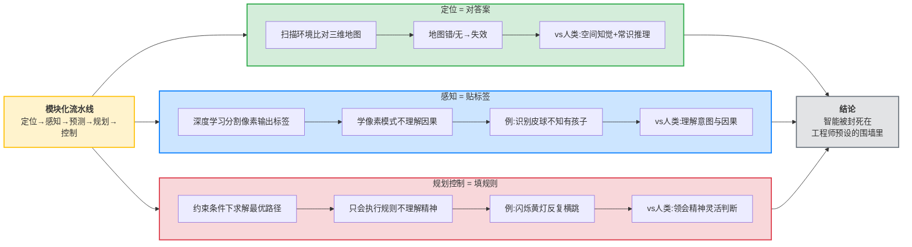
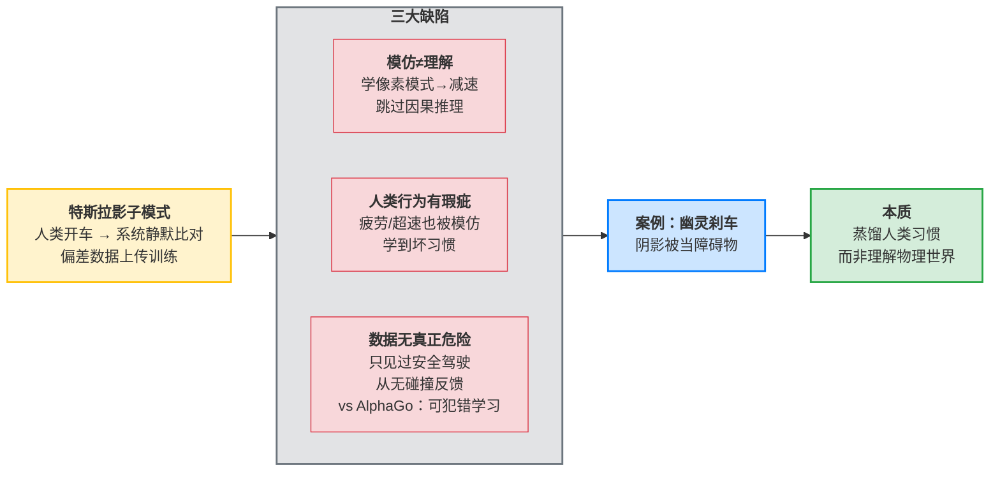
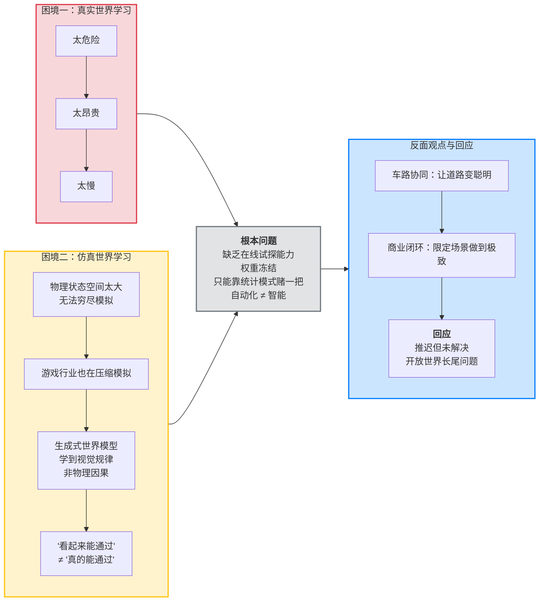
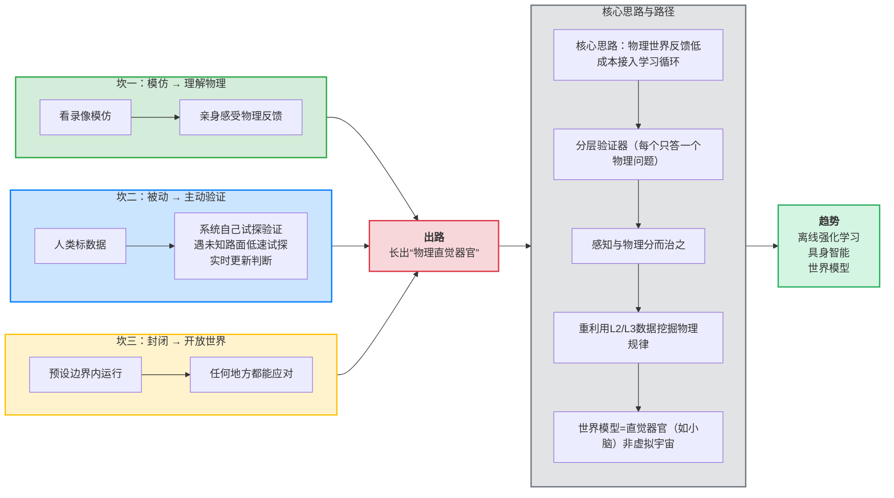
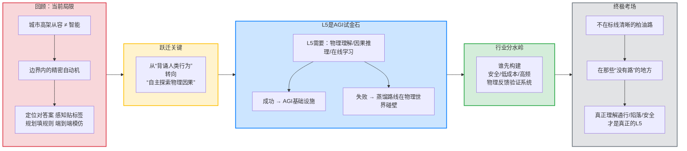

# 撕掉“L4/L5”的包装纸：万字长文还原自动驾驶真实的智能困境

> 前自动驾驶研发工程师：如果你在路上看到自动驾驶车辆，请尽量保持距离。现在的自动驾驶车辆看似从容，实则从未真正学会驾驶；城市高架上的流畅表现，本质上是对规则化环境中人类行为的统计逼近——依赖高精地图、清晰标线和预设交规。然而，从感知、预测到规划，每个模块都是概率模型，输出的只是“置信度”，而非确定性的因果理解。当场景落在训练分布之内，一切正常；一旦遭遇数据长尾中的未知环境，或模型权重发生偏差，它便可能以极高的置信度，给出一个荒唐的判断。

## 1. 背景与问题：被修辞包裹的智能真相

有一个事实可能会让许多人感到意外：今天，一辆能够在上海高架路上从容变道、在加州郊区完成无保护左转的自动驾驶汽车，如果把它开到暴雨后的泥泞机耕道，或者一片没有任何标线的戈壁滩，它大概率会立即“死机”。不是引擎熄火，而是它的决策系统会陷入彻底的茫然，寸步难行。而任何一个有驾照的普通人，哪怕完全没有在这种环境中开过车，也能慢速试探着找到一条路。

同样，当一家自动驾驶公司宣称自己的车辆具备“L4级能力”时，这往往只意味着这辆车在某个城市的某几条特定道路上，在特定的天气条件下，能够完成自动驾驶。一旦驶出这个被精心维护的“温室”，车辆要么拒绝启动自动驾驶功能，要么会在遭遇第一个意外时立刻要求人类接管。

这并非某个公司的技术缺陷，而是整个行业正在面临的普遍现实。我们被一种巧妙的修辞所包围：企业将有限的场景支持包装成“L4/L5能力”，让公众误以为自动驾驶已经接近或达到了人类水平的通用驾驶智能。但如果我们拆开这些包装，看到的将是一个与宣传截然不同的图景——一个在智力谱系上还处于相当低级阶段的系统。今天自动驾驶的核心能力，本质上并不是真正的“驾驶”，而是一种在高度结构化环境中对人力驾驶行为的大规模模仿。

要看清这一点，我们需要先走进一辆自动驾驶汽车的大脑，解剖它的思考方式，审视它所在的技术困境，并最终眺望那条通向真正通用驾驶智能的艰难路径。

### 1.1 为什么我们需要诚实地谈论自动驾驶的智能水平？

公众对自动驾驶的认知，很大程度上被企业精心编排的演示视频和“L4级能力”这类模糊术语所塑造。这带来了双重风险：一方面，过度乐观的预期可能导致用户在辅助驾驶功能上放松警惕，引发安全悲剧；另一方面，当技术迟迟无法兑现“全无人驾驶”的承诺时，资本与舆论的剧烈反转可能让整个行业陷入新的寒冬。历史上有过前车之鉴，20世纪80年代的人工智能寒冬，部分原因正是早期符号主义AI的承诺远超其实际能力，最终导致研究经费被大幅削减。自动驾驶行业正站在相似的十字路口，诚实地剖析技术的真实智能水平，不是唱衰，而是为了找到通往更高智能的正确路径。

## 2. 核心内容展开：解剖“高级智能”的真相

### 2.1 被精心裁剪的“高级”：L4/L5的真相

国际自动机工程师学会对L5级自动驾驶的定义清晰而严苛：车辆可以在任何地方、任何天气、任何路况下完成所有驾驶任务，无需人类干预。这个定义的本质是“通用性”——车能开到哪儿，自动驾驶就能用到哪儿。但今天公司们是如何“实现”这个目标的？策略是把“任何地方”偷换成“我们选定的地方”。

这种典型的做法被称为“地理围栏”。一家公司会在某座城市划出一片区域，用激光雷达车对这片区域进行高精度地图采集，把每一条车道线、每一个红绿灯、每一个人行横道扫描到厘米级精度。然后在这片区域内反复测试、不断打补丁，直到车辆的表现达到可接受的水平。此时，公司对外宣称：我们的自动驾驶系统已经在某城市实现了L4级能力。

但这句话漏掉了一个关键的定语：在某城市的指定区域内。如果把这辆车开到一公里外一条未采集地图的道路上，它的定位模块会因为找不到地图匹配而陷入混乱；如果遇到一场突如其来的暴雨，摄像头会被雨滴遮挡，激光雷达会被水雾干扰；如果路边出现一个交警用手势指挥交通，感知系统大概率无法识别——因为训练数据里没有足够多的交警手势样本。

这就是当前所谓“L4/L5”的本质：它不是通用驾驶能力，而是在特定边界条件内跑通的一条脆弱的自动化管道。这些边界条件包括：高精度地图已覆盖、车道线清晰可见、天气良好、光照正常、交通参与者行为可预测、不存在非标准化的指挥或标识。一旦这些边界被移除，系统就崩溃。

更值得警惕的是，一些公司甚至把这种有限能力包装成“技术领先”的证明。他们在精心挑选的测试路线上录制一镜到底的自动驾驶视频，展示车辆如何丝滑地处理无保护左转、如何从容地避开路边停靠车辆。这些视频被媒体广泛传播，被投资者当作技术进展的佐证。但每一个内行人都知道，这条路可能已经被跑了几百遍，每一个场景都经过了针对性的算法调优。它演示的不是通用智能，而是在固定剧本上的完美排练。

#### 2.1.1 地理围栏之外：一个案例的设想
设想一辆在凤凰城郊区表现完美的自动驾驶出租车。凤凰城以宽阔、规整、车流量相对较低的道路闻名。现在，将这辆车空运到印度班加罗尔晚高峰的一个无信号灯环岛。在那里，车辆、突突车、摩托车、行人、甚至偶尔出现的神牛以一种看似混乱但实则有内在协商逻辑的方式交织在一起。几乎没有清晰的标线，不存在标准的让行规则，通行全靠眼神、手势和喇叭的微观博弈。这就是“分布外”场景的极端体现。当前依赖规则和模式匹配的系统，在这种环境中连最基本的“我是谁，我在哪，我该怎么办”的问题都无法回答，更遑论参与到这套复杂的、非语言的社会协商机制中了。这就是“任何地方”这个定语的真实分量。

### 2.2 解剖一辆自动驾驶汽车：它看到的世界与你完全不同

要理解自动驾驶为何如此脆弱，我们需要深入它的内部架构。今天的乘用车自动驾驶系统，绝大多数采用一种叫做“模块化流水线”的架构。这个架构像一条工业生产线，把驾驶任务拆成几个步骤：我在哪里？周围有什么？接下来会发生什么？我该怎么做？把这几个问题分别交给定位、感知、预测与规划控制等不同模块去解决，最后把结果拼在一起，变成方向盘和踏板的指令。正是这种分解方式，决定了它的智能上限。

#### 2.2.1 定位：它不是在“看路”，而是在“对答案”

你可能会以为自动驾驶汽车像人一样，看着窗外的建筑、路牌和车道线，就能判断自己在哪里。但事实上，目前大多数L4级自动驾驶系统依赖一种叫做“高精度地图匹配”的技术。高精度地图是一张提前扫描好的三维地图，厘米级地记录了每条车道的几何形状、信号灯的位置、限速标志的坐标。车辆行驶时，激光雷达或摄像头不断扫描周围环境，把扫描到的点云或图像特征与地图数据库进行比对，就像用指纹在指纹库里找人一样，找到最匹配的那个点，然后就知道了：我现在在这条车道的这个位置，精确到厘米。

这套方法在结构清晰的城市道路上非常高效，但它有一个致命的软肋——它是一种“对答案”式的定位，而不是“理解空间”的定位。一旦地图错了，比如前方临时施工、车道线被重新画过，或者根本不存在地图，比如一条乡村土路，这辆车就相当于一个在闭卷考试中突然发现题目不在考前背诵范围内的学生，当场傻眼。而人类驾驶员靠的是空间知觉和常识推理：跟着车辙走、观察树木和山势、记住刚才路过的那个红色谷仓。两者之间的智能水平差距，是“按图索骥”和“探索未知”的差距。

#### 2.2.2 感知：一堆标签的堆砌，而非世界的理解

第二个模块是感知，任务是从传感器数据中识别出周围的物体：车、人、自行车、交通标志、路面标线。今天主流的感知模型都是基于深度学习的，神经网络会把摄像头图像和激光雷达点云分割成一个个像素级或体素级的标签——这个区域是“汽车”，那个区域是“行人”，那边是“可行驶区域”。

这套技术已经相当成熟，识别准确率在标准测试集上高得惊人。但它的“聪明”是一种表面的聪明。模型学会的是“这种像素排列模式往往对应着‘行人’这个标签”，而不是“这里有一个活生生的、有意图的、可能随时改变方向的人类”。它不理解物理实体之间的因果联系。举个例子，当人类驾驶员看到路边一个皮球滚到马路中间，会本能地减速，因为他推断皮球后面很可能跟着一个追球的孩子。但自动驾驶的感知模型，如果训练数据中没有大量“皮球-孩子”连续出现的样本，它只能识别出“皮球”这个障碍物，完全不知道皮球意味着什么。它看到的是一堆被正确标注的物体，却没有看到一个有因果逻辑的物理世界。

这就是当前感知模块的本质：它是模式匹配的冠军，却是因果推理的白痴。更讽刺的是，为了训练这些感知模型，工程师们需要花费大量人力去标注数据——用鼠标在数百万张图片上画出每个物体的边界框，告诉神经网络“这叫卡车”“这叫行人”。整个系统的基础知识，是人类一口一口喂进去的。

#### 2.2.3 决策与规划、控制：在规则围墙里的循规蹈矩

有了定位和感知，接下来是决策、规划、控制。决策模块负责判断周围交通参与者的未来动向；规划模块决定自车接下来几秒钟的行驶轨迹；控制模块把轨迹转换成具体的方向盘转角、油门和刹车指令。

这一整套流程，本质上是把驾驶问题变成了一道数学优化题：在由车道线、交通规则、障碍物边界构成的约束条件下，求解一条平滑的、安全的、高效的路径。系统并不“理解”它为什么要遵守这些规则，它只是忠实地执行工程师写好的规则引擎和成本函数。

这就解释了为什么在面对一个闪烁黄灯的路口，自动驾驶会变得犹豫不决——它的规则引擎在“这是黄灯，应该减速”和“等一下，它又灭了，这算什么灯”之间反复横跳。而人类会立刻意识到“信号灯坏了，这里应该当作无信号灯路口处理，减速观察、礼让通行”。这种对规则背后精神的领会、对现实情境的灵活判断，对当前的自动驾驶系统来说是天方夜谭。它的智能，是被封死在工程师预设好的规则围墙里的。

## 3. 深度分析：从模仿的幻象到双重困境

### 3.1 模仿的幻象与数据的陷阱

如果说依赖高精度地图的路线被困在了“地理围栏”里，那么另一条路线——以特斯拉为代表的纯视觉端到端方案——则陷入了另一种困境：模仿学习的陷阱。

特斯拉走了一条纯视觉路线，不依赖高精度地图和激光雷达，只用摄像头来感知世界。理论上，这更接近人类驾驶的方式：人类开车不需要激光测距，也不需要在脑袋里装载一张厘米级的三维地图，我们用眼睛看、用大脑判断。但特斯拉的实现方式，恰恰最鲜明地体现了当前自动驾驶“低级智能”的本质。

特斯拉的自动驾驶系统通过“影子模式”来学习：在所有配备了Autopilot硬件的车辆上，系统在人类驾驶时持续运行但不控制车辆，它将人类驾驶员的实际操作与系统自己的预测进行比对。当两者出现显著偏差时，这段数据就被上传到服务器，成为训练素材。全球数百万特斯拉车主在不知情的情况下，无偿地成为了特斯拉的数据标注员。

这套系统的工程逻辑听起来很合理：收集尽可能多的人类驾驶数据，让神经网络从中学习驾驶策略。但从智能层级的角度审视，这个逻辑存在根本性的缺陷。

**首先，这种学习方式的本质是“模仿”而非“理解”。** 模型学到的不是“为什么在这个情况下应该减速”，而是“大多数人类在这个像素模式下会减速”。它把驾驶简化为一个感知到动作的模式映射问题，跳过了中间的因果推理、物理判断和常识运用。当模型遇到一个在训练数据中从未出现的场景——比如沙漠中只有车辙没有车道线，比如被洪水冲毁一半的路面——它不会像人类那样运用物理直觉和常识来摸索出解决方案，而是会输出一个不可预测的错误动作。

**其次，人类驾驶行为本身就是有缺陷的。** 人类会疲劳、会分心、会超速、会在不该犹豫的时候犹豫。把这些行为当作“金标准”来学习，本质上是在蒸馏一个有瑕疵的样本。更糟糕的是，模仿学习很容易学到虚假相关性：如果训练数据中大部分驾驶员在某个路段都超速行驶，模型可能学到“这条路的设计限速太低了”；如果训练数据中人类司机极少遇到儿童从路边突然冲出的场景，模型就永远学不会“看到皮球滚到路上应该预判有孩子”。它不是学到了驾驶的智慧，而是学到了人类驾驶的集体习惯——包括那些坏习惯和认知盲区。

**第三，也是最危险的一点：数据中几乎没有真正的危险场景。** 特斯拉收集的都是“人类正在安全驾驶”的数据。一个强化学习系统如果需要学会避免碰撞，它必须先经历碰撞，哪怕是虚拟的，来获得负反馈。但特斯拉的数据采集机制决定了，它只能看到人类如何避免危险，却看不到危险真正发生时的物理后果。模型只见过好人，从未见过坏人，却在期待它识别出坏人。

这种模仿学习的困境，并不仅限于特斯拉。近年来，业界出现了一股“端到端自动驾驶”的热潮，用一个巨大的神经网络直接从传感器输入映射到方向盘和踏板的控制输出。从某种意义上，端到端确实减少了人工设计模块的痕迹，但它的智能本质依然是“蒸馏人类”。它的成功前提是：测试场景必须在训练数据的分布范围之内。一旦遇到训练数据中从未出现过的场景，端到端模型就会输出不可预测的错误。

这与AlphaGo的学习方式形成鲜明对比。AlphaGo之所以能超越人类棋手，是因为它被允许在验证环境中自由探索——它可以下出最荒唐的棋，输掉无数盘对局，然后在输棋的反馈中一点点修正策略。而自动驾驶系统从未被允许真正“失败”，它只能在人类驾驶的阴影下蹑手蹑脚地模仿，永远不敢越雷池一步。这种系统不会被允许“开进泥沼以理解泥沼”，它只被允许“看人类如何绕开泥沼然后模仿”。两者的智能差距，是探索者与背诵者之间的差距。

#### 3.1.1 具体案例：幽灵刹车与长尾问题
模仿学习的缺陷在现实中屡见不鲜。特斯拉车辆曾多次被报告出现“幽灵刹车”现象——在空旷的高速公路上，车辆会突然无缘由地急刹。一个被广泛讨论的推测（待验证）是，模型在训练时学到了人类司机在遇到前方桥梁或路牌阴影时的犹豫或轻微减速行为，由于缺乏对“阴影是无害的”这一物理因果的理解，系统在某些光照条件下将阴影误判为需要紧急制动的障碍物。这正是“蒸馏人类习惯”而非“理解物理世界”的直接后果。自动驾驶的长尾问题，并非仅仅是数据量的问题，更是数据“质”的问题——你永远无法穷尽所有可能的危险场景，尤其当你的数据源头本身就在回避危险时。

### 3.2 双重困境：仿真不行，真实也不行

既然纯模仿人类数据走不通，那么让AI在仿真中自行探索、自由碰撞、从失败中学习呢？这听起来合理，但自动驾驶正陷入一个尴尬的双重困境：真实世界学习太危险太昂贵，仿真世界学习又不够真实。

许多研究者把希望寄托在“世界模型”上。世界模型的核心思想是：让AI不依赖人类标注，而是通过学习海量无监督数据，比如视频，自己构建出对物理世界运行规律的内部表征。然后在这个内部模型里进行“想象推演”——如果我现在打方向盘，下一秒会发生什么？这样就可以摆脱对真实路测的依赖，安全高效地学会驾驶。

这个想法很迷人，但它面临一个致命的问题：物理世界的状态空间大到无法被穷尽模拟。一辆车以30公里的时速开过一片碎石路面，就那么一瞬间，如果想用物理模型精确模拟，需要计算什么？每颗石子的几何形状、硬度、摩擦系数，石子之间的接触力，轮胎橡胶的粘弹性变形，胎面花纹与石子的微观咬合，悬架系统的瞬时响应，车身受到的冲击……这还只是一个轮子。真实世界还有风、湿度、沙尘、路面下方看不见的暗坑。要把这些全都模拟出来，需要的计算资源是天文数字。

游戏行业早就用行动告诉了我们“模拟一切”有多不切实际。现代3A游戏大作里那些看起来逼真的物理效果，其实都是精心设计的欺骗。开放世界地图看起来无边无际，实际上玩家视野之外的细节会被立即卸载；水和雪的模拟用的是低分辨率的粒子特效；NPC的智能行为树通常不超过几十个节点。整个行业都在拼命压缩状态空间，只模拟那些对游戏体验最关键的少数变量。如果连允许穿模和重来的游戏都不得不这样做，那么要求自动驾驶在仿真里学会所有可能的物理交互，无异于痴人说梦。

更值得警惕的是，当前最火的“生成式世界模型”路线——通过观看视频来生成下一帧画面——可能正在把我们引向一个更隐蔽的认知陷阱。这类模型学到了“沙漠在阳光下应该是什么样子”、“车辙从近到远应该如何逐渐模糊”，但它们学到的是视觉规律，而不是物理因果。当AI在这个生成式世界里踩下油门，生成的下一帧画面可能是基于训练视频里类似场景的“平均结果”——它看起来或许很合理，但那不是物理推演，而是视觉模式的拼贴。AI学会的不是“怎样做能安全通过”，而是“怎样做看起来像能安全通过”。

但如果我们把镜头拉远，会发现真正的问题不在于“选哪个环境”，而在于自动驾驶系统从根本上缺乏一种能力：在缺乏完整信息的情况下，通过与环境的试探性交互来获取关键反馈，并以此调整行为的能力。这是生物智能的标志性特征——一只老鼠不需要一张全局地图就能在迷宫中找到出口，它通过不断试错和记忆来构建局部的空间认知。但当前的自动驾驶系统本质上都是离线训练的：所有学习都发生在训练阶段，测试阶段的模型权重是冻结的。当它遇到一个从未见过的场景，它不能在线学习，只能依赖训练阶段积累的统计模式来“赌一把”。

这就是为什么当前自动驾驶在本质上还是一种“自动化”而非“智能”。自动化的特征是：为已知场景预设解决方案，按照既定逻辑执行。智能的特征是：面对未知场景，通过探索、推理和反馈来构造新的解决方案。用这个标准来衡量，今天最先进的自动驾驶系统仍然站在自动化的阵营里。当然，这并不意味着它们毫无智能成分——即使是最简单的自动驾驶系统也包含感知、决策、控制等多个环节的复杂协调，而这些环节中有不少已经超越了纯粹的“预设方案”。更准确地说，它们是在“自动化为主、智能萌芽为辅”的阶段：优势在于处理已知场景的稳定性和精确性，瓶颈在于面对未知时的脆弱。

#### 3.2.1 反面观点与争议：我们真的需要那么“智能”吗？
对于上述技术困境，行业内也存在不同的声音。一种观点认为，我们可能根本不需要一个能像人类一样在任何地方开车的“通用驾驶智能”。通过车路协同技术，让道路本身变得更“聪明”（例如，在路边安装传感器和计算单元，将交通信息直接发送给车辆），就能极大降低对单车智能的要求。另一种观点着眼于商业闭环，主张在有限的地理围栏内做到极致的安全，比如只在城市中的固定路线运营低速无人配送车或接驳车，也能创造巨大价值。这些路径避开了对“通用智能”的硬性追求，转而在限定场景内将“自动化”做到完美。然而，反方观点认为，这推迟了但并未解决核心问题：面对开放世界中不可预测的“长尾”场景，任何依赖预设条件和外部智力的系统，其天花板都是显而易见的。

## 4. 行业趋势、展望与跨越智能鸿沟的路径

### 4.1 从低级到高级：自动驾驶需要跨越的三道坎

如果当前自动驾驶处于“低级智能”阶段，那么走向真正通用驾驶智能的路，需要翻越三道坎。

**第一道坎，是从“模仿人类”到“理解物理”。** 今天的系统学习驾驶的方式本质上是看录像——看人类怎么开，然后照着做。但它永远学不到人类司机肌肉记忆里的那种物理直觉：方向盘突然变轻意味着前轮附着力下降，车身横向的细微摆动意味着即将侧滑，前方路面反光的质感从“湿润”变成“镜面”意味着结冰。这些直觉不是从视频里学来的，而是从无数次与物理世界的直接交互中长出来的。未来的自动驾驶必须找到一种方式，让系统能够安全地与物理世界“短兵相接”——哪怕只是在精心设计的受限场景中进行有监督的探索，也要让系统亲自感受到物理反馈的因果链条。

**第二道坎，是从“被动标注”到“主动验证”。** 今天的系统依赖人类为它标好每一张图、写好每一条规则。但真正智能的系统应该能够自己提出问题、自己设计实验、自己验证假设。想象一个真正高级的自动驾驶系统，当它第一次看到一片从未见过的灰色泥泞路面时，它不会像今天这样直接拒绝行驶或盲目冲进去，而是会像人类一样进行试探：以极低速度驶入边缘，通过车轮转速传感器和惯性测量单元感受地面附着力，用几秒钟的交互数据在线更新自己对“这种路面特性”的内部表征，然后决定是继续前进还是绕行。这种“即时的微型科研”能力，是区分自动化和智能的分水岭。

**第三道坎，是从“封闭场景”到“开放世界”。** 今天所有宣称L4/L5的系统，都是在封闭或半封闭的场景中运行的。这里的“封闭”不是指物理围栏，而是指问题空间的边界被预设好了——车道线存在、交通规则明确、参与者类型有限、地图可用。一旦这些边界被移除，系统就崩溃。真正的通用驾驶智能，必须能够在完全开放的世界中运行——那里可能没有路、没有规则、没有地图、没有其他人类车辆，只有漫无边际的草原或沙漠，而目的地是对面那个山头。这听起来像科幻，但这是L5定义的应有之义：任何地方、任何条件、完全无人。

这三道坎每一道都是硬骨头。它们不是在现有框架上修修补补就能解决的，而是需要整个技术范式的根本性转变。从统计模式匹配转向因果推理，从离线蒸馏转向在线交互，从封闭场景过拟合转向开放世界泛化。

### 4.2 真正的出路：不是建造虚拟宇宙，而是长出“物理直觉器官”

面对这样的困境，出路究竟在哪里？要回答这个问题，我们需要退后一步，重新审视“学习”这件事的根本。

任何学习型系统——无论是生物还是机器——要想变聪明，必须具备一个条件：它必须能获得客观、廉价、高密度的反馈信号，告诉它什么是对、什么是错。这被称为“验证环境”。围棋AI之所以能超越人类，是因为围棋规则提供了一个完美的验证环境：每一步的合法性可以立刻判定，终局胜负是一个明确的标量信号，AI可以在几天内自我对弈几千万盘，每一盘都是一次完整的“假设-验证”循环。

而当前自动驾驶的验证环境是什么呢？训练阶段，验证信号是“和人类操作差多少”；测试阶段，验证信号是安全员有没有接管。这两种信号都是主观的、稀疏的、昂贵的，严重制约了智能的进化。

当然，围棋与驾驶之间存在根本差异：围棋是完全可观测、规则确定的封闭系统，驾驶则是部分可观测、充满物理噪声的开放系统。这意味着我们不可能为自动驾驶复制一个围棋式的完美验证环境。但这并不意味着我们无能为力——恰恰相反，它意味着我们需要一种更聪明的方式来接入物理反馈，而非指望一个全知全能的仿真器。

真正的突破，或许在于找到一种方式，把物理现实这个“终极验证器”的反馈信号，以低成本、高频率的方式接入到学习循环中。物理世界本身不需要任何计算资源，它就是完美的模拟器。问题只在于我们无法让AI直接在真实世界里大量试错——那太危险、太慢了。但如果能建造一种“分层验证系统”，让AI在关键决策点上快速获得来自物理规律而非人类偏好的客观反馈，就有可能突破当前的瓶颈。

具体来说，这意味着我们要放弃让一个统一模型去“知道一切”的执念，转而去构建一系列专门的、小型的“验证器”。比如，一个专门验证“这种路面条件、这种胎压下，这种油门深度会不会导致车轮打滑”的模块。这个模块不需要模拟所有石子的几何形状，它可以是一个经过真实世界数据校准的简化因果模型——在真实泥地、沙地、雪地上采集几千次通过数据，训练出一个能给出可靠判别信号的专门网络。它的价值不在于模拟得有多逼真，而在于它的验证信号来自于与物理现实的直接交互，而不是对视频的视觉模仿。

当然，这条路也有它自己的挑战。一个驾驶场景中的因果链条往往是互相纠缠的——车辆在经过积水弯道时，轮速差、横摆角速度、悬架压缩量同时变化，要把“这种路面附着系数下、这个转向角度是否安全”作为独立问题干净地剥离出来，需要先解决因果解耦的技术难题。这不是一个简单的“数据自动化挖掘”就能搞定的事，它需要专门设计的实验场景和因果推断算法。但关键不在于这些困难是否可解，而在于方向是否正确——从试图模拟一切，转向让物理世界自己提供反馈，然后从中提取出可复用的因果片段。

沿着这个思路，另一个宝贵资源就是已经大规模部署的L2/L3车队。这些车每天都在真实道路上行驶，用真实的传感器和轮胎与物理世界发生交互。每一次经过积水和施工路段，每一次在无标线环岛中穿行，都产生了珍贵的因果数据——从感知输入到车辆姿态的完整链条。这和特斯拉的影子模式是两回事：影子模式收集数据的目的是模仿人类怎么开车，而这里要做的是提取物理上发生了什么。同样的传感器数据，前者把它变成“驾驶行为蒸馏器”，后者把它变成“物理规律挖掘机”——标签从“人类怎么打方向盘”变成了“车身姿态怎么变”。一旦标签变了，人类偏好就不再是标准答案，物理事实才是唯一的裁判。

这样一来，我们就可以把这些数据用来训练和校准成百上千个专门的验证器。每一个验证器只负责回答一个具体的物理问题：这种路面附着系数下，这个转向角度是否安全？这个坡度上，当前的制动力是否足够？这些问题的答案，不来自于任何人类驾驶员的偏好，而来自于车辆自身传感器记录的、无可辩驳的物理反馈——轮速差、横摆角速度、悬架压缩量。这就是“用物理现实来压缩物理现实”——不模拟一切，而是把真实世界天然提供的验证信号高效地回收再利用。

更进一步，感知和物理应该分而治之。感知层面确实需要高保真的视觉仿真，因为感知模型需要对视觉外观高度敏感。但规划控制层面的仿真，可以大幅降低物理模拟的精度——只要验证信号在决策层面是正确的就够了。当系统预测“这个速度冲进泥沼会陷车”时，它不需要渲染每一粒泥沙的飞溅效果，只需要输出一个经过真实数据校准的“安全通过概率低于阈值”的信号。感知的“高分辨率”和物理的“低分辨率”通过一个抽象层耦合，既保证了视觉的真实性，又避免了物理模拟的算力黑洞。

沿着上述思路，我们或许需要彻底改变对世界模型的认知方式。世界模型不应该被理解为用来替代真实世界的虚拟宇宙，而应该被理解为智能体身上的一种“物理直觉器官”——就像人类的小脑和前庭系统。我们不靠精密计算牛顿力学来走路，而是靠亿万年进化锤炼出来的、高度精炼的物理体感。这种体感不追求精确到小数点后多少位，但能在关键时刻给出足够好的判断：“这个速度下坡，前面的碎石太松了，刹车！”

如果这样理解，L5自动驾驶的终极目标，就不是造出一个能够模拟宇宙的超级计算机，而是让机器长出这样一种面向驾驶任务的物理直觉器官。这种器官的训练数据，必须来自与物理世界的直接碰撞和反馈，而不能仅仅来自对人类行为的观摩。它需要在无数次的虚拟探索和少量但关键的真实交互中，慢慢“悟”出重力、摩擦、惯性这些物理概念在驾驶中的含义。

#### 4.2.1 最新进展与趋势：世界模型、离线强化学习与具身智能
截至2026年中，业界正沿着这个方向进行积极探索。一方面，以OpenAI的Sora和Google的Genie系列为代表的世界模型，展示了从视频中学习物理规律的巨大潜力，尽管它们目前仍存在“视觉拼贴”而非“因果推演”的争议。另一方面，离线强化学习技术正试图从现有的大规模驾驶数据中，通过价值函数估计来提炼出最优策略，以此规避模仿学习单纯复制行为的缺陷。更重要的是，“具身智能”已成为一个核心研究热点。它强调智能必须通过身体与物理世界交互来产生，这与本文倡导的“长出物理直觉器官”不谋而合。许多研究机构正尝试在低成本、可重复的受限物理环境中（如缩小比例的越野场地）让无人车进行安全试错，以此训练基础的物理推理能力。这些趋势共同指向了一点：业界正集体从纯粹的“大数据蒸馏”模式，转向探索“与物理世界闭环交互”的下一代范式。Claude模型演进的路径也侧面佐证了这一点，从文本对话走向对物理世界进行理解与交互的探索，是AI发展的宏观方向。

## 5. 总结：L5——通用人工智能的试金石

### 5.1 从“条件反射”到“智能”

当我们看到一辆自动驾驶汽车在城市高架上平稳行驶，我们很容易陷入一种错觉：它很聪明。但把它推到一片没有标线的泥泞路面，这种“聪明”立刻原形毕露。它不是聪明，它只是被良好地编程、被大量地训练，在特定的边界条件内表现得像一个聪明的系统。

这不是贬低自动驾驶技术的成就。能够在复杂城市道路中做到极高比例的自主行驶，这本身就是一项令人惊叹的工程壮举。但我们必须诚实地面对一个事实：目前的自动驾驶系统，本质上是人类驾驶行为的统计镜像加上工程师编写的规则引擎。它的定位是对答案式的，它的感知是标签堆砌式的，它的规划是规则填空式的，它的端到端是对人类行为的模仿式蒸馏。所有这些模块加在一起，构成了一台精密的自动机——在熟悉的舞台上它可以演得惟妙惟肖，但一旦剧本被拿走、舞台被拆掉，它就会露出自动机的本色。

智能的进化，从来不是靠把条件反射堆得更多更全。从低级智能向高级智能的跃迁，需要一种结构性的变革——让系统能够走出人类为它划定的符号牢笼，直接面对物理现实的检验，在假设与验证的循环中，自己长出对世界的理解。这需要的不是更好的传感器、更多的数据、更大的模型，而是一个范式转变：让机器从“背诵人类行为的标准答案”转向“在物理世界中自主探索因果规律”。

这个转变的路径目前还不清晰，但方向是明确的：构建一个能够让驾驶智能安全地提问、低成本地试错、高频率地获取物理反馈的验证环境，让智能在与世界的交互中自己长出对驾驶的理解。在那一天到来之前，每一次自动驾驶公司宣称的“L4/L5突破”，我们都应该带着适度的怀疑去审视。这不是怀疑论，而是对智能本质的尊重。

### 5.2 L5为何是AGI的试金石？

现在我们可以更深刻地理解“如果连L5都做不好，AGI就没有希望”这句话的含义了。

AGI的定义是通用人工智能——一个能在各种环境和任务中表现出人类水平或超越人类水平智能的系统。而L5自动驾驶恰恰是AGI的一个绝佳缩影：它要求系统在物理世界中完成一个目标明确、反馈清晰的任务，但同时这个任务所处的环境是开放的、多变的、充满不确定性的。如果连在这种相对单纯的任务框架下，系统都无法发展出应对开放世界的通用能力，那么我们又凭什么相信AGI能够在政治谈判、哲学思辨、艺术创作这些目标模糊、反馈复杂、没有客观标准的领域有所作为？

反过来，如果我们在L5上取得了真正的突破——不是靠投机取巧的场景裁剪和数据堆砌，而是靠让系统发展出真正的物理理解、因果推理和在线学习能力——那么这套能力将直接成为AGI的基础设施。一个能够理解物理世界的智能系统，距离理解更抽象的人类事务，就只剩下符号和知识的迁移问题了。

在物理世界中自主行动，是智能最古老、最底层的定义。早在语言、逻辑和符号出现之前，生命就已经通过行动与反馈的循环在学习。L5之所以如此艰难，恰恰是因为它要求的不是对人类的模仿，而是让智能体真正睁开眼睛看物理世界，用物理世界那无可辩驳的、硬碰硬的反馈来修剪自己的行为。这需要一种与当前大语言模型那种“在人类文本里打转”截然不同的学习范式——一种根植于因果、验证和具身交互的范式。

如果连在一个目标如此清晰、反馈如此明确的任务中都走不通这个范式，那么AGI在面对更模糊、更没有客观验证标准的复杂人类事务时，将更加举步维艰。L5如果失败，那将不是自动驾驶一个行业的失败，而是整个以“蒸馏人类符号”为核心的AI路线在物理世界面前的一次结结实实的碰壁。

这也解释了为什么自动驾驶是当前最具战略价值的人工智能试验田。它不是AI的一个应用分支，而是具身智能在真实物理世界中最系统、最大规模的实验。它所暴露出来的问题——验证环境质量低下、分布外脆弱、因果推理缺失、模仿学习的上限——无一不是整个AI领域面临的共性难题。而它所需要的突破——世界模型的构建、与物理世界的闭环验证、在线元学习——无一不是通向AGI的关键技术。

从这个视角看，自动驾驶公司的竞争，本质上不是传感器方案之争，也不是要不要高精度地图之争。真正的分水岭在于：谁能率先构建一个让机器安全地、低成本地、高频率地从物理世界获取反馈的验证系统，谁就能率先推动自动驾驶从“条件反射”走向“物理理解”。这场竞赛的技术外溢，将远超交通出行本身——它将为整个具身智能领域提供最核心的基础设施：一个教会机器如何向物理世界提问的平台。

真正的通用驾驶智能，不会轻易被地理围栏框住，不会在无路的荒野里熄火，不会在看到泥泞就拒绝前进。它会在任何可以想象的地表上找到路——哪怕从未有人教过它那里该怎么走。

自动驾驶的终极考场，不在那些标线清晰的柏油路上，而在那些“没有路”的地方。当一台机器终于能在任何一片旷野中找到自己的方向，不是因为有人教过它那里该怎么走，而是因为它真正理解了什么是通行、什么是陷落、什么是安全——那一刻，这台机器就完成了它的物理成年礼。

那才是真正的L5。那才是真正学会了驾驶。

#### 读者可关注的后续方向
1.  **因果推断在感知模块的具体应用**：超越纯粹的模式识别，模型如何学习“皮球滚过马路可能意味着有孩子”这类因果常识。
2.  **离线强化学习的技术进展**：该技术如何从海量人类驾驶数据中，不仅模仿，更能推导出超越人类水平的最优驾驶策略。
3.  **具身智能在受限物理环境中的实验成果**：关注那些在小规模、可重复的物理环境中（如沙地、泥地）让无人车进行安全试错的科研项目进展。